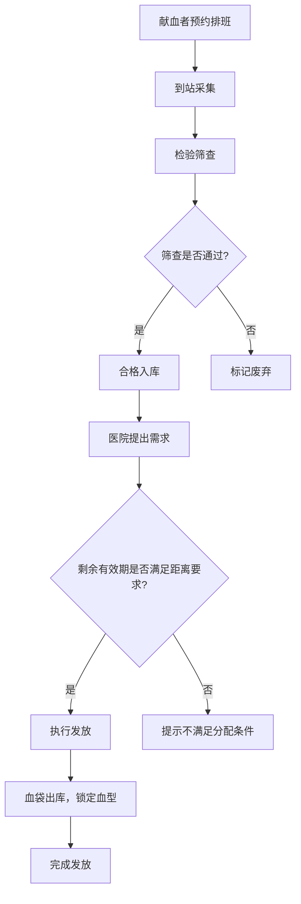

## 1. 产品概述

血液中心血小板预约采供系统，覆盖从献血者排班、检验筛查到医院发放的全流程闭环管理。解决血小板采集与供应中排班混乱、筛查遗漏、库存错配等核心问题，服务于血液中心招募岗、检验岗和发血岗三类工作人员。

## 2. 核心功能

### 2.1 用户角色

| 角色 | 进入方式 | 核心权限 |
|------|----------|----------|
| 招募人员 | 系统登录 | 维护献血者信息与可约时段、查看采集状态 |
| 检验人员 | 系统登录 | 录入筛查结果、查看待筛献血者 |
| 发血岗 | 系统登录 | 查看库存、匹配医院需求、执行发放操作 |

### 2.2 功能模块

1. **工作台首页**：血小板供应全链路概览，关键指标看板，待办提醒
2. **献血者排班**：献血者档案维护、可约时段管理、预约采集登记
3. **检验筛查**：待筛列表、筛查结果录入、筛查不合格标记
4. **库存与发放**：实时库存查看、医院需求登记、智能匹配与发放

### 2.3 页面详情

| 页面名称 | 模块名称 | 功能描述 |
|----------|----------|----------|
| 工作台首页 | 供应看板 | 当日采集数、库存量、待发放数、过期预警统计 |
| 工作台首页 | 待办提醒 | 待筛查献血者、即将过期血袋、待处理发放请求 |
| 工作台首页 | 流程追踪 | 采集→筛查→入库→发放全流程可视化时间线 |
| 献血者排班 | 献血者档案 | 献血者基本信息（姓名、血型、联系方式、历史记录） |
| 献血者排班 | 时段管理 | 日历视图维护可约时段，支持批量设置和单日调整 |
| 献血者排班 | 预约登记 | 选择献血者+时段完成预约，自动流转至待筛查 |
| 检验筛查 | 待筛列表 | 按预约时间排序的待筛查献血者清单 |
| 检验筛查 | 结果录入 | 传染病标志物筛查结果录入，合格/不合格判定 |
| 检验筛查 | 历史查询 | 历史筛查记录查询与导出 |
| 库存与发放 | 库存总览 | 按血型分类的库存数量、有效期倒计时 |
| 库存与发放 | 医院需求 | 医院血型需求登记，紧急程度标记 |
| 库存与发放 | 发放执行 | 智能匹配库存与需求，有效期+距离校验，执行发放 |

## 3. 核心流程

献血者预约 → 招募排班确认 → 到站采集 → 检验筛查 → 合格入库 / 不合格废弃 → 医院提出需求 → 发血岗匹配库存（校验有效期与距离）→ 执行发放 → 血袋出库

**业务规则约束**：
- 筛查未通过 → 禁止入库采集，血袋标记为废弃
- 血小板剩余有效期不足 → 禁止分配给远距离医院
- 已发放血袋 → 血型信息不可修改

## 4. 用户界面设计

### 4.1 设计风格

- **主色调**：深红（#B91C1C 血液主题）+ 暖白（#FAFAF9 背景）+ 深灰（#1C1917 文字）
- **辅助色**：琥珀黄（#D97706 预警）+ 翠绿（#059669 正常/合格）+ 石板灰（#57534E 边框）
- **按钮风格**：微圆角（rounded-lg），主操作用实色填充，次要操作用描边
- **字体**：标题用 Noto Serif SC 衬线体突出专业感，正文用 Noto Sans SC 无衬线体保证可读性
- **布局风格**：左侧导航 + 右侧内容区，卡片化内容组织
- **图标**：Lucide 图标库，线条风格

### 4.2 页面设计概览

| 页面名称 | 模块名称 | UI要素 |
|----------|----------|--------|
| 工作台首页 | 供应看板 | 四宫格统计卡片（采集/库存/发放/预警），渐变色图标，数字大字突出 |
| 工作台首页 | 流程追踪 | 横向步骤条，当前步骤高亮，已完成步骤打勾，动画过渡 |
| 献血者排班 | 时段管理 | 月历网格，可约时段绿点标记，点击弹出编辑弹窗，支持拖拽选区 |
| 献血者排班 | 预约登记 | 表单卡片，献血者搜索下拉，时段选择器，一键提交 |
| 检验筛查 | 待筛列表 | 表格视图，行内快捷录入按钮，筛选标签栏 |
| 检验筛查 | 结果录入 | 分步表单，项目勾选+数值输入，自动判定合格/不合格 |
| 库存与发放 | 库存总览 | 血型分组卡片，进度条展示有效期，过期红色闪烁 |
| 库存与发放 | 发放执行 | 左侧需求列表 + 右侧匹配结果面板，一键确认发放 |

### 4.3 响应式策略

桌面优先设计，最小支持 1280px 宽度。表格和卡片在小屏幕下堆叠显示。

### 4.4 动效设计

- 页面切换：淡入淡出 + 微位移
- 数据更新：数字滚动动画
- 状态变更：色块渐变过渡
- 预警提示：脉冲闪烁
