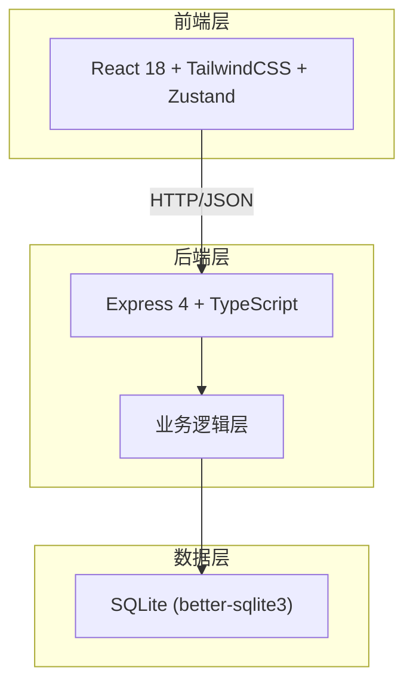
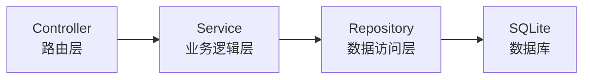
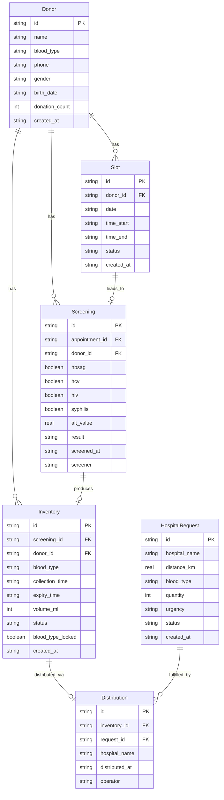

## 1. 架构设计



## 2. 技术说明

- **前端**：React@18 + TailwindCSS@3 + Vite + Zustand
- **初始化工具**：vite-init (react-express-ts 模板)
- **后端**：Express@4 + TypeScript (ESM)
- **数据库**：SQLite (better-sqlite3)，数据持久化存储在文件中
- **状态管理**：Zustand
- **路由**：react-router-dom

## 3. 路由定义

| 路由 | 用途 |
|------|------|
| / | 工作台首页 - 供应看板与待办 |
| /schedule | 献血者排班 - 时段管理与预约登记 |
| /screening | 检验筛查 - 待筛列表与结果录入 |
| /inventory | 库存与发放 - 库存总览、医院需求与发放 |

## 4. API 定义

### 4.1 献血者与排班

```
GET    /api/donors              获取献血者列表
POST   /api/donors              新增献血者
PUT    /api/donors/:id          更新献血者信息
GET    /api/donors/:id          获取献血者详情

GET    /api/slots               获取排班时段列表（按月查询）
POST   /api/slots               新增排班时段
PUT    /api/slots/:id           更新排班时段
DELETE /api/slots/:id           删除排班时段

GET    /api/appointments        获取预约列表
POST   /api/appointments        新增预约
PUT    /api/appointments/:id    更新预约状态
```

### 4.2 检验筛查

```
GET    /api/screenings          获取筛查列表（可筛选状态）
POST   /api/screenings          录入筛查结果
GET    /api/screenings/:id      获取筛查详情
```

### 4.3 库存与发放

```
GET    /api/inventory           获取库存列表（按血型分组）
POST   /api/inventory           新增入库记录
PUT    /api/inventory/:id       更新库存状态

GET    /api/hospital-requests   获取医院需求列表
POST   /api/hospital-requests   新增医院需求
PUT    /api/hospital-requests/:id 更新需求状态

POST   /api/distributions       执行发放
GET    /api/distributions       获取发放记录
```

### 4.4 统计看板

```
GET    /api/dashboard/stats     获取首页统计数据
GET    /api/dashboard/todos     获取待办事项
```

### 4.5 TypeScript 类型定义

```typescript
interface Donor {
  id: string;
  name: string;
  blood_type: "A" | "B" | "O" | "AB";
  phone: string;
  gender: "男" | "女";
  birth_date: string;
  donation_count: number;
  created_at: string;
}

type SlotStatus = "available" | "booked" | "completed" | "cancelled";

interface Slot {
  id: string;
  donor_id: string;
  date: string;
  time_start: string;
  time_end: string;
  status: SlotStatus;
  created_at: string;
}

type ScreeningResult = "passed" | "failed";

interface Screening {
  id: string;
  appointment_id: string;
  donor_id: string;
  hbsag: boolean;
  hcv: boolean;
  hiv: boolean;
  syphilis: boolean;
  alt_value: number;
  result: ScreeningResult;
  screened_at: string;
  screener: string;
}

type InventoryStatus = "available" | "distributed" | "expired" | "discarded";

interface Inventory {
  id: string;
  screening_id: string;
  donor_id: string;
  blood_type: "A" | "B" | "O" | "AB";
  collection_time: string;
  expiry_time: string;
  volume_ml: number;
  status: InventoryStatus;
  blood_type_locked: boolean;
  created_at: string;
}

type RequestUrgency = "routine" | "urgent" | "critical";

interface HospitalRequest {
  id: string;
  hospital_name: string;
  distance_km: number;
  blood_type: "A" | "B" | "O" | "AB";
  quantity: number;
  urgency: RequestUrgency;
  status: "pending" | "fulfilled" | "cancelled";
  created_at: string;
}

interface Distribution {
  id: string;
  inventory_id: string;
  request_id: string;
  hospital_name: string;
  distributed_at: string;
  operator: string;
}
```

## 5. 服务端架构图



## 6. 数据模型

### 6.1 数据模型定义



### 6.2 数据定义语言

```sql
CREATE TABLE IF NOT EXISTS donors (
    id TEXT PRIMARY KEY,
    name TEXT NOT NULL,
    blood_type TEXT NOT NULL CHECK(blood_type IN ('A','B','O','AB')),
    phone TEXT NOT NULL,
    gender TEXT NOT NULL CHECK(gender IN ('男','女')),
    birth_date TEXT NOT NULL,
    donation_count INTEGER DEFAULT 0,
    created_at TEXT NOT NULL DEFAULT (datetime('now'))
);

CREATE TABLE IF NOT EXISTS slots (
    id TEXT PRIMARY KEY,
    donor_id TEXT NOT NULL REFERENCES donors(id),
    date TEXT NOT NULL,
    time_start TEXT NOT NULL,
    time_end TEXT NOT NULL,
    status TEXT NOT NULL DEFAULT 'available' CHECK(status IN ('available','booked','completed','cancelled')),
    created_at TEXT NOT NULL DEFAULT (datetime('now'))
);

CREATE TABLE IF NOT EXISTS screenings (
    id TEXT PRIMARY KEY,
    appointment_id TEXT NOT NULL REFERENCES slots(id),
    donor_id TEXT NOT NULL REFERENCES donors(id),
    hbsag INTEGER NOT NULL DEFAULT 0,
    hcv INTEGER NOT NULL DEFAULT 0,
    hiv INTEGER NOT NULL DEFAULT 0,
    syphilis INTEGER NOT NULL DEFAULT 0,
    alt_value REAL NOT NULL DEFAULT 0,
    result TEXT NOT NULL CHECK(result IN ('passed','failed')),
    screened_at TEXT NOT NULL,
    screener TEXT NOT NULL
);

CREATE TABLE IF NOT EXISTS inventory (
    id TEXT PRIMARY KEY,
    screening_id TEXT REFERENCES screenings(id),
    donor_id TEXT NOT NULL REFERENCES donors(id),
    blood_type TEXT NOT NULL CHECK(blood_type IN ('A','B','O','AB')),
    collection_time TEXT NOT NULL,
    expiry_time TEXT NOT NULL,
    volume_ml INTEGER NOT NULL DEFAULT 250,
    status TEXT NOT NULL DEFAULT 'available' CHECK(status IN ('available','distributed','expired','discarded')),
    blood_type_locked INTEGER NOT NULL DEFAULT 0,
    created_at TEXT NOT NULL DEFAULT (datetime('now'))
);

CREATE TABLE IF NOT EXISTS hospital_requests (
    id TEXT PRIMARY KEY,
    hospital_name TEXT NOT NULL,
    distance_km REAL NOT NULL,
    blood_type TEXT NOT NULL CHECK(blood_type IN ('A','B','O','AB')),
    quantity INTEGER NOT NULL DEFAULT 1,
    urgency TEXT NOT NULL DEFAULT 'routine' CHECK(urgency IN ('routine','urgent','critical')),
    status TEXT NOT NULL DEFAULT 'pending' CHECK(status IN ('pending','fulfilled','cancelled')),
    created_at TEXT NOT NULL DEFAULT (datetime('now'))
);

CREATE TABLE IF NOT EXISTS distributions (
    id TEXT PRIMARY KEY,
    inventory_id TEXT NOT NULL REFERENCES inventory(id),
    request_id TEXT NOT NULL REFERENCES hospital_requests(id),
    hospital_name TEXT NOT NULL,
    distributed_at TEXT NOT NULL,
    operator TEXT NOT NULL
);

CREATE INDEX IF NOT EXISTS idx_slots_donor ON slots(donor_id);
CREATE INDEX IF NOT EXISTS idx_slots_date ON slots(date);
CREATE INDEX IF NOT EXISTS idx_screenings_donor ON screenings(donor_id);
CREATE INDEX IF NOT EXISTS idx_screenings_appointment ON screenings(appointment_id);
CREATE INDEX IF NOT EXISTS idx_inventory_status ON inventory(status);
CREATE INDEX IF NOT EXISTS idx_inventory_blood_type ON inventory(blood_type);
CREATE INDEX IF NOT EXISTS idx_inventory_expiry ON inventory(expiry_time);
CREATE INDEX IF NOT EXISTS idx_hospital_requests_status ON hospital_requests(status);
CREATE INDEX IF NOT EXISTS idx_distributions_inventory ON distributions(inventory_id);
CREATE INDEX IF NOT EXISTS idx_distributions_request ON distributions(request_id);
```
